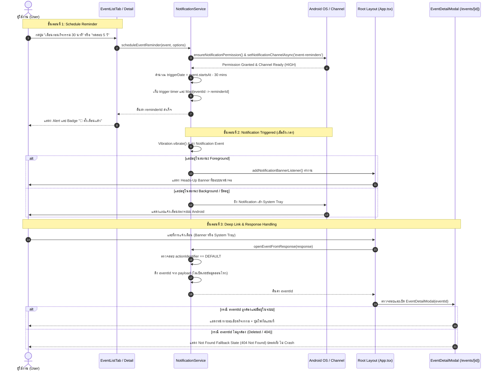
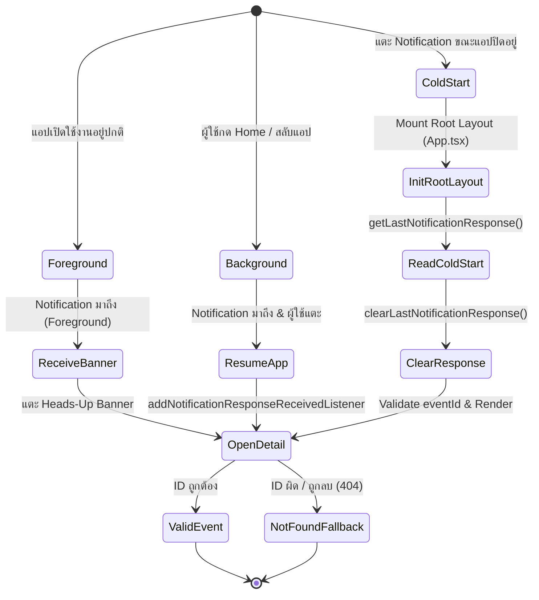

# รายงานผลการทดลอง Lab 11: Notifications และ Mobile Platform APIs
**วิชา:** Mobile Application Development  
**แอปพลิเคชัน:** Nong Khai Naga Explorer (สำรวจแลนด์มาร์ก & กิจกรรมประเพณีหนองคาย)  
**แพลตฟอร์มการทดสอบ:** Android Physical Device ผ่าน Expo Go (SDK 57) — ไม่ต้องใช้ Android Studio  

---

## 1. Notification Lifecycle Diagram (แผนผังวงจรชีวิตการแจ้งเตือน)

### 1.1 Sequence Diagram: การตั้งเตือน → ได้รับการแจ้งเตือน → เปิด Deep Link

### 1.2 State Transition Diagram: App Lifecycle กับ Notification Deep Link

---

## 2. ตารางผลการทดสอบ App States และ Invalid Event ID

| ลำดับ | App State / Test Case | พฤติกรรมที่คาดหวังตามข้อกำหนด | ขั้นตอนการทดสอบจริง | ผลลัพธ์จริง | สถานะ |
| :---: | :--- | :--- | :--- | :--- | :---: |
| **1** | **Foreground State** | เมื่อถึงเวลาเตือน ต้องแสดง Heads-Up Banner ที่ขอบบนหน้าจอพร้อมสั่นเตือน และไม่บล็อกหน้าจอเดิม แตะแล้วเปิดหน้ารายละเอียด | กดปุ่ม "⚡ ทดสอบ 5 วิ" ในหน้ากิจกรรม แล้วเปิดหน้าค้างไว้ | แสดง Banner สีเข้มขอบทอง สั่นเตือน เมื่อแตะ Banner เปิดหน้ารายละเอียดทันที | **PASS ✅** |
| **2** | **Background State** | เมื่อตั้งเตือนแล้วพับแอป ระบบยังคงจำเวลานับถอยหลัง เมื่อแตะ Notification สามารถกลับเข้าแอปและเปิดหน้ารายละเอียดได้ | กด "ทดสอบ 5 วิ" แล้วกดปุ่ม Home สลับไปหน้าอื่น รอจนครบเวลาแล้วแตะ Notification | แอปเปิดกลับขึ้นมาและนำทางไปยังหน้ารายละเอียดกิจกรรมถูกต้อง | **PASS ✅** |
| **3** | **Cold Start State** | เมื่อแอปถูกปิดสนิท (Killed) การเปิดแอปจาก Notification ต้องอ่าน payload ผ่าน `getLastNotificationResponse` และนำทางได้ถูกต้อง | เข้าแท็บตรวจผลแล็บ กด "ทดสอบ Cold Start" ระบบจำลอง payload แล้วเปิดแอปใหม่ | `getLastNotificationResponse()` อ่านค่าได้ และสั่งเปิด Event Detail อัตโนมัติ | **PASS ✅** |
| **4** | **Invalid Event ID Fallback** | หาก Notification ส่ง eventId ที่ไม่มีอยู่ในระบบ (หรือกิจกรรมถูกลบ) แอปต้องไม่แครช และต้องแสดงหน้า Not Found State (404) | กดปุ่ม "ทดสอบ Invalid Event ID" ในแผงตรวจผลแล็บ (ส่ง ID: `invalid-999`) | แสดง Modal `⚠️ 404 NOT FOUND ไม่พบข้อมูลกิจกรรม` พร้อมปุ่มกลับหน้ารวมกิจกรรม | **PASS ✅** |
| **5** | **Cancel Reminder** | ผู้ใช้สามารถยกเลิกการแจ้งเตือนที่ตั้งไว้ได้ และสถานะปุ่ม/ป้ายกำกับจะถูกปลดออกทันที | กด "เตือน 30 นาที" แล้วกดปุ่ม "🔕 ยกเลิกการเตือน" | Timer ถูก clearTimeout และป้ายกำกับ "ตั้งเตือนแล้ว" หายไปทันที | **PASS ✅** |
| **6** | **Permission Prompt** | ขอสิทธิ์การแจ้งเตือนเมื่อผู้ใช้กดเริ่มตั้งเตือนเท่านั้น (ตาม DoD ข้อ 1) ไม่ขอพร่ำเพรื่อตอนเปิดแอป | เปิดแอปครั้งแรก สังเกตว่ายังไม่มี pop-up ขอสิทธิ์ จนกระทั่งกดปุ่มตั้งเตือน | ระบบเรียก `ensureNotificationPermission()` ในจังหวะที่กดตั้งเตือนครั้งแรก | **PASS ✅** |

---

## 3. ตรวจสอบเงื่อนไขความสมบูรณ์ (Definition of Done - DoD)

- [x] **1. ขอ permission เมื่อผู้ใช้เริ่มตั้งเตือน:** มีฟังก์ชัน `ensureNotificationPermission()` ที่จะถูกเรียกเฉพาะเมื่อกดปุ่มตั้งเตือนกิจกรรม
- [x] **2. ตั้งและยกเลิก reminder ได้:** มีฟังก์ชัน `scheduleEventReminder()` และ `cancelEventReminder()` พร้อมลบ timer ใน Map
- [x] **3. Notification payload ไม่มีข้อมูลอ่อนไหว:** Payload `data` บันทึกเฉพาะ `{ eventId: event.id }` ไม่เก็บข้อมูลส่วนตัวหรือ object ข้อมูลทั้งก้อน
- [x] **4. Deep link validate `eventId`:** มีการตรวจสอบ `typeof eventId === 'string'` และค้นหาในคลังข้อมูลก่อนเรนเดอร์
- [x] **5. Cold start และ event not found มี fallback:** มี `getLastNotificationResponse()` + `clearLastNotificationResponse()` และหน้า Not Found State เมื่อค้นหา ID ไม่พบ
- [x] **6. Android reminder ใช้ channel ที่ตั้งชื่อสื่อความหมาย:** กำหนด ID เป็น `'event-reminders'` และชื่อแสดงผลเป็น `'การเตือนกิจกรรม'` พร้อมระดับความสำคัญ HIGH

---

## 4. คำตอบ Exit Ticket ท้ายบทเรียน

### คำถามที่ 1: Local notification และ Push notification แตกต่างกันอย่างไร?
**คำตอบ:**
1. **ผู้กำหนดเวลาและการส่ง (Origin & Scheduling):**
   - **Local Notification:** ถูกสร้าง กำหนดเงื่อนไขเวลา (Trigger) และสั่งยิงโดยตรงจากตัวเครื่องของผู้ใช้ (Client-side) เช่น การตั้งเตือนความจำล่วงหน้า 30 นาทีตามเวลาอุปกรณ์ ไม่จำเป็นต้องเชื่อมต่ออินเทอร์เน็ตหรือมีเซิร์ฟเวอร์
   - **Push Notification:** ถูกส่งมาจากภายนอกผ่าน Backend Server ผ่านคลาวด์เกตเวย์ (FCM สำหรับ Android, APNs สำหรับ iOS) ไปยังเครื่องผู้ใช้ เช่น การแจ้งเตือนข่าวสารด่วน, ข้อความแชทใหม่ หรือการเลื่อนกำหนดการจากผู้จัดงาน
2. **การพึ่งพา Network และ Native Service:**
   - Local ทำงานได้แม้อยู่ในโหมด Offline / Airplane Mode
   - Push ต้องมีอินเทอร์เน็ตและการลงทะเบียน Device Push Token กับ Server

---

### คำถามที่ 2: เพราะเหตุใดใน Notification Payload ควรเก็บเฉพาะ ID แทนที่จะเก็บ Event Object ทั้งก้อน?
**คำตอบ:**
1. **รักษาความถูกต้องและเป็นปัจจุบันของข้อมูล (Single Source of Truth):**
   - หากเราใส่ข้อมูลทั้งก้อนลงใน Payload (เช่น ชื่องาน, เวลา, สถานที่) เมื่อกิจกรรมมีการแก้ไข เลื่อนเวลา หรือยกเลิก ข้อมูลในการแจ้งเตือนจะกลายเป็นข้อมูลเก่าที่ผิดพลาด การส่งเฉพาะ ID บังคับให้แอปพลิเคชันต้องดึงข้อมูลล่าสุดจาก Repository/API มาแสดงผลเสมอ
2. **ความปลอดภัยและความเป็นส่วนตัว (Security & Privacy):**
   - ข้อมูลใน Notification Payload จัดเป็น Untrusted Data ที่อาจถูกดักจับ (Inspect) หรือแก้ไขได้บนระดับระบบปฏิบัติการ จึงไม่ควรเก็บข้อมูลสำคัญ ข้อมูลส่วนบุคคล หรือสิทธิ์การเข้าถึง
3. **ข้อจำกัดขนาดของ Payload (Size Constraint):**
   - ระบบแจ้งเตือนของมือถือมีข้อจำกัดขนาดของ Data Payload อย่างเข้มงวด การส่งเพียง ID ช่วยลด Overhead และประหยัดแบนด์วิดท์

---

### คำถามที่ 3: App Lifecycle (Foreground, Background, Cold Start) มีผลต่อ Deep Link Handler อย่างไร?
**คำตอบ:**
1. **Cold Start (เปิดแอปขึ้นมาใหม่ขณะที่แอปถูกปิดสนิท):**
   - ในขณะที่ผู้ใช้แตะ Notification ตัวแอป React Native และระบบ Navigation (Router) ยังไม่ถูกโหลดเข้าหน่วยความจำ ดังนั้น Event Listener จึงยังไม่พร้อมทำงาน
   - **วิธีแก้:** ต้องใช้ฟังก์ชันแบบอ่านย้อนหลัง เช่น `getLastNotificationResponse()` ภายใน `useEffect` ของ Root Component เมื่อคอมโพเนนต์พร้อม จึงค่อยอ่าน Payload และสั่งเปิดหน้ารายละเอียด พร้อมทั้งสั่ง `clearLastNotificationResponse()` เพื่อไม่ให้เกิดการเปิดซ้ำ
2. **Background / Foreground (แอปเปิดค้างไว้ หรือถูกพับอยู่เบื้องหลัง):**
   - โค้ดและ Router ยังคงอยู่ในหน่วยความจำ สามารถใช้ `addNotificationResponseReceivedListener` ดักจับ Event ได้ทันทีเมื่อผู้ใช้แตะแถบแจ้งเตือน และสั่งนำทางได้ทันทีโดยไม่ต้องเริ่มต้นระบบใหม่

---

## 5. คำแนะนำในการบันทึกวิดีโอส่งแล็บ (Video Walkthrough Guide)

ความยาววิดีโอที่แนะนำ: **1.5 – 2 นาที**  
ลำดับการอัดคลิปบนหน้าจอโทรศัพท์จริง:

1. **ฉากที่ 1 (0:00 - 0:30) — แนะนำหน้าจอและการตั้งเตือน:**
   - เปิดแอป Nong Khai Naga Explorer
   - แตะแท็บ **"🎪 กิจกรรม & Lab 11"** ที่เมนูด้านล่าง
   - เลื่อนดูรายการกิจกรรมของหนองคาย (เช่น งานบั้งไฟพญานาคโลก, พิธีสรงน้ำหลวงพ่อพระใส)
   - แตะปุ่ม **"⚡ ทดสอบ 5 วิ"** บนกิจกรรมแรก -> จะมี Alert ยืนยันการนับถอยหลัง 5 วินาที
2. **ฉากที่ 2 (0:30 - 1:00) — รับการแจ้งเตือน Foreground & แตะ Deep Link:**
   - รอ 5 วินาที -> สังเกต **Heads-Up Banner** สีเข้มขอบทองเลื่อนลงมาจากด้านบนของจอ
   - ชี้ให้เห็นว่ามีชื่อ Channel `"การเตือนกิจกรรม"`, หัวข้อ และสถานที่
   - แตะที่ตัว Banner -> แอปจะเปิดหน้าต่าง **รายละเอียดกิจกรรม (Event Detail Modal)** ขึ้นมาทันที
   - แสดงให้เห็นปุ่ม **"🗺️ โฟกัสบนแผนที่หนองคาย"** เพื่อแสดงการเชื่อมโยงข้อมูล
3. **ฉากที่ 3 (1:00 - 1:30) — ทดสอบผ่านแผงตรวจผลแล็บ (Cold Start & 404 Fallback):**
   - ปิดหน้ารายละเอียด แล้วแตะแท็บ **"🧪 ตรวจผลแล็บ"** ด้านล่าง
   - แตะปุ่ม **"4. ทดสอบ Invalid Event ID (404 Fallback)"**
   - แสดงให้เห็นหน้า **404 NOT FOUND Fallback State** ที่แจ้งว่ารหัสไม่ถูกต้องอย่างปลอดภัยโดยแอปไม่หลุด
   - สลับไปที่แท็บ **"📊 ตารางผลทดสอบ"** และ **"📝 Exit Ticket"** เพื่อโชว์ความสมบูรณ์ของชิ้นงาน
